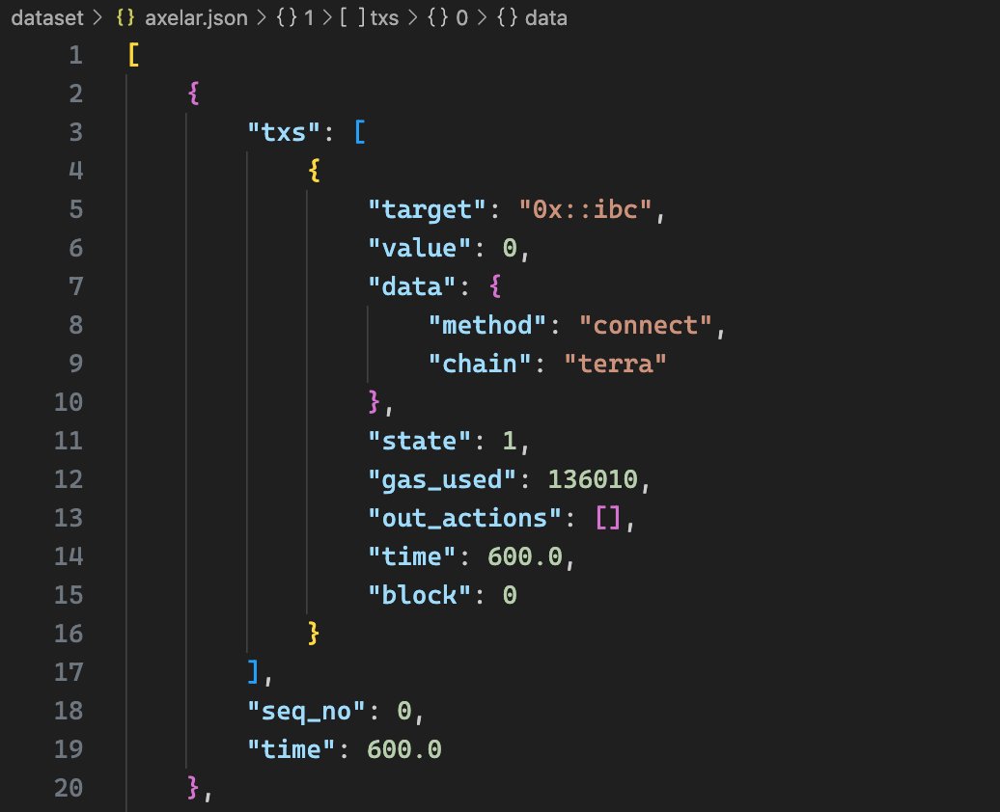
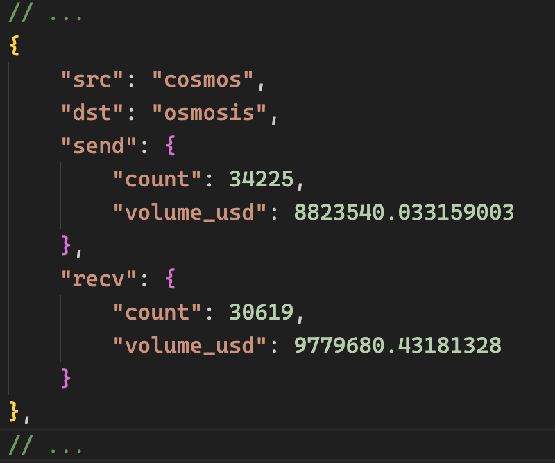
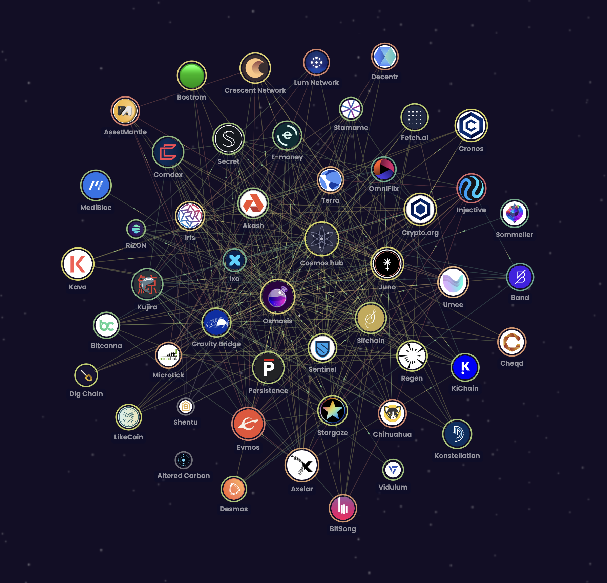
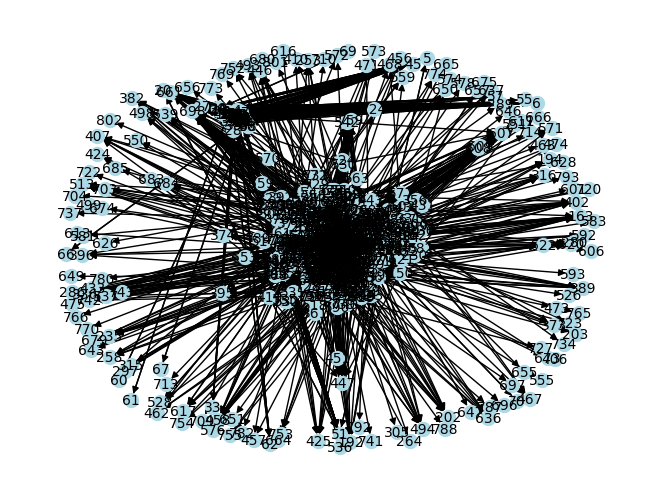

# Cosmos Simulation
This repository serves as the codebase for a cosmos chain simulator. **It contains the simulation framework as well as the data collected and new generated datasets.**

## Dataset 
### Dataset Format

### Link Data

## Network
### Current Network

### New Generated Network

